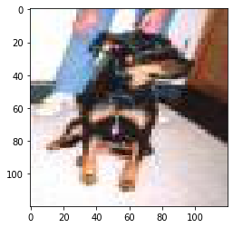
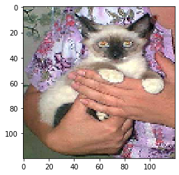
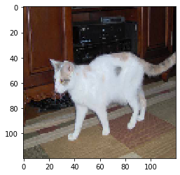
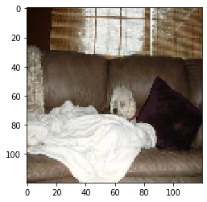

# Cats vs Dogs - transfer learning

This project attempts to correctly classify images of dogs and cats using two different Deep Neural Networks (DNNs):

- a simple, self-built DNN with 3 convolutional layers and 1 output layer
- The Xception model with a retrained output layer (transfer learning)

This project was developed in week 9 of the data science bootcamp at Spiced.

**Technologies**: keras / tensorflow, numpy

**Dataset**: The data comes from a kaggle dataset with 25,000 images of dogs and cats. The images are in color and varying dimensions. You can find it here: www.kaggle.com/c/dogs-vs-cats

Here are some example pictures (already with reduced resolution fed to the DNN):

The difference in performance of the two models is striking: The model built from scratch has a test accuracy of  53% (i.e. barely better than chance) while the transfer learning model built on the Xception model has an test accuracy of a whopping 93%

Let's take a look at some of the **misclassified pictures** by the second model. While some do not seem to be overly difficult to classify (at least for a human eye)... 

... others show how that the task is not always trivial:

## To do:

- Train DNNs with full dataset
- Upload predictions to kaggle

